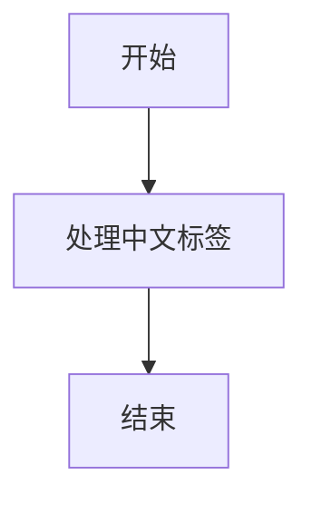

# MPPL

MPPL(Markdown to PDF with Pandoc via \LaTeX{}) 提供了一种将 Markdown 转换为 PDF 的解决方案。你可以使用 Docker 镜像免去安装依赖，也可以自行按照以下文档部署，将其作为 Pandoc 的一个模板使用。

# 使用 Docker

```bash
# 拉取镜像
docker pull ghcr.io/dunky-z/mppl/mppl:latest
# 进入文档目录
cd MPPL/samples
# 转换文档
docker run --rm -v $(pwd)/:/mppl mppl -o mppl-sample.pdf mppl-sample.md
# 转换含 Mermaid 图表的文档
docker run --rm -v $(pwd)/:/mppl mppl -o mppl-mermaid-sample.pdf mppl-mermaid-sample.md
```

Windows Git Bash 下挂载卷需使用双斜杠路径，例如：

```bash
docker run --rm -v "//c/Develop/MPPL/samples:/mppl" mppl -o mppl-mermaid-sample.pdf mppl-mermaid-sample.md
```

## 构建并发布 Docker 镜像

版本号记录在仓库根目录 `VERSION` 文件（当前 **2.1.0**，含 Mermaid 导出与章节编号配置）。

### 一键构建并发布

```bash
# 1. 配置 DockerHub 用户名（首次）
cp scripts/dockerhub.env.example scripts/dockerhub.env
# 编辑 scripts/dockerhub.env，设置 DOCKERHUB_USERNAME

# 2. 登录 DockerHub
docker login

# 3. 构建并推送（读取 VERSION 作为镜像 tag，同时推送 latest）
./scripts/docker-build-push.sh
```

常用选项：

```bash
./scripts/docker-build-push.sh --build-only    # 仅构建，不推送
./scripts/docker-build-push.sh --no-cache      # 禁用构建缓存
./scripts/docker-build-push.sh --version 2.0.1 # 临时指定版本 tag
```

发布新版本前，先更新根目录 `VERSION` 文件中的 semver 版本号。

### 手动构建与测试

```bash
docker build -t YOUR_DOCKERHUB_USER/mppl:latest .

# 测试基础 Markdown 转换
docker run --rm -v $(pwd)/samples:/mppl YOUR_DOCKERHUB_USER/mppl:latest \
  -o mppl-sample.pdf mppl-sample.md

# 测试 Mermaid 图表转换（含中文标签）
docker run --rm -v $(pwd)/samples:/mppl YOUR_DOCKERHUB_USER/mppl:latest \
  -o mppl-mermaid-sample.pdf mppl-mermaid-sample.md
```

Windows Git Bash 下测试时挂载卷需使用双斜杠路径：

```bash
docker run --rm -v "//c/Develop/MPPL/samples:/mppl" YOUR_DOCKERHUB_USER/mppl:latest \
  -o mppl-mermaid-sample.pdf mppl-mermaid-sample.md
```

# 自行部署

Markdown 生成 PDF 主要需要使用 Pandoc 和 Latex(texlive) 两个工具，具体安装方式如下：

## Pandoc 的安装

Pandoc 是由 John MacFarlane 开发的标记语言转换工具，可实现不同标记语言间的格式转换。

- Windows 下的安装：
  - 下载[安装包](https://github.com/jgm/pandoc/releases)直接安装即可
  - 如果安装了 Chocolate：`choco install pandoc`
  - 如果安装了 winget：`winget install pandoc`

- Linux/FreeBSD下的安装：
  - Pandoc 已经包含在大部分 Linux 发行版的官方仓库中，直接使用诸如`apt/dnf/yum/pacman`之类的安装工具直接安装即可
  
- macOS 下的安装：
  - `brew install pandoc`

> 详细的安装说明参见：[官方安装文档](https://pandoc.org/installing.html)

## LaTeX 的安装

LaTeX 工具，在 Windows 下建议安装 miktex，Linux 和 macOS 下建议安装 texlive

- Windows 下的安装：
  - [参考该文章](https://zhuanlan.zhihu.com/p/41855480)下载完整 texlive，注意安装后需要再安装 cjk，cjk-fonts 等相关 package
- Linux/FreeBSD下的安装：
  - 使用 `apt/dnf/yum/pacman/pkg` 等安装工具安装 texlive、texlive-latex 等相关软件包
- macOS 下的安装：
  - 使用 HomeBrew 安装 texlive 即可

## 字体安装

### Windows

```bash
# 复制字体文件到 C:\Windows\Fonts 目录
copy MPPL\fonts\* C:\Windows\Fonts

# 重新加载字体缓存
fc-cache -fv
```

如果无法生效，将`fonts`目录下的字体拖动到`C:\Windows\Fonts`目录。

### Ubuntu

```bash
$ echo ttf-mscorefonts-installer msttcorefonts/accepted-mscorefonts-eula select true | debconf-set-selections
$ apt-get install -y \
        fontconfig \
        ttf-mscorefonts-installer

$ cp MPPL/fonts/* /usr/share/fonts/

$ mkfontscale &&  mkfontdir &&  fc-cache && fc-list
```

# 模板配置

## 配置 Pandoc 模板

为保证生成的 pdf 格式（自动插入封面、目录页、页眉页脚等信息），在本地环境中安装模板，具体步骤是：

- 下载本仓库
- 将`template/mppl.tex`拷贝到`*/pandoc/templates`目录下
  - Window 下：`C:/Users/USERNAME/AppData/Roaming/pandoc/templates`，如果`Roaming`没有`pandoc`目录，请手动创建
  - Linux/FreeBSD/MacOS：`~/.pandoc/templates/`

## 配置 LaTeX 模板

模板定制主要修改模板最前面的**模板基础配置**相关内容，主要可修改的包括：

- 公司和组织，目前默认是"MPPL"
- 正文缩进，目前默认是`0em`
- 主要中文字体和英文字体：目前都是微软雅黑
- 页眉、页脚展示内容，目前是：
  - 左页眉：标题
  - 右页眉："企业机密 - 禁止外传"
  - 左页脚：company
  - 右页脚：页码

# 生成 PDF

## PDF 文件指定 metadata 信息

在每个 Markdown 最前面增加以下主要 metadata 信息，metadata 内容开始行和结束行为三个“-”，示例如下：

```yml
---
title: "Markdown 语法简明教程"
version: V0.1
author: "Dominic"
date: "2022-08"
company: COMPANYNAME
file-code: COMPANY-DEPARTMENT-00000000
logo: true
logo-url: ./img/Markdown-mark.png
lot: true
lof: true
chapter-level: 2
section-numbering: true
history:
  - version: V0.1
    author: Dominic
    date: 2022 年 08 月 20 日
    desc: 创建示例文档
---
```

可选配置项目如下：

- lof: 是否创建图片目录
- lot: 是否创建表格目录
- date: 是否显示日期
- company: 是否显示公司名
- version: 是否显示版本号
- mainfont: 主要英文字体
- monofont: 主要代码字体
- CJKmainfont: 主要中文字体
- file-code: 是否显示文件编号
- department: 是否显示部门名
- footer-left: 左页脚
- header-left: 左页眉
- header-right: 右页眉
- footer-right: 右页脚
- chapter-level: 作为章节编号的 Markdown 标题级别（1–6），默认 `1`；常见写法为 `2`（一级标题作文章名，二级标题作章节）
- section-numbering: 是否自动为章节编号，`true` / `false`，默认 `true`；设为 `false` 时保留 Markdown 标题中的手工序号
- table-col-weights: 可选，覆盖自动列宽估算的相对权重，如 `[1, 2, 2, 3, 2, 1]`（按列顺序，数值越大列越宽）

> 1. 可选配置项中，建议除了 subtitle 外，全部在模板中定制，不在 Markdown 文件中定制
> 2. 可选配置项中，如果不需要显示填`department: false`，如果需要显示，显示的内容即填写的内容如：`department: 后端开发部`

章节编号示例：

```yml
# 二级标题（##）作为章节，并自动编号（1、1.1、1.2 …）
chapter-level: 2
section-numbering: true

# 标题中已手写「第一章」「1.1」等序号，关闭自动编号
chapter-level: 2
section-numbering: false
```

## 表格导出策略

PDF 中的 Markdown 表格由 `config/mppl-table.lua` 自动处理，无需手改列宽标记：

- **内容感知列宽**：按各列最长单元格估算相对宽度（短列收窄、描述列加宽），并强制在页面宽度内折行
- **长标识符断行**：在 `_`、`-`、`.`、`/` 与驼峰边界插入零宽断点，避免 `Require_MacroRepairCode` 一类单词截断叠字
- **拥挤表缩小字号**：列数不少于 5，或单元格平均内容偏长时，该表使用 `\footnotesize`
- **可选覆盖**：`table-col-weights: [1, 2, 3, 2]` 按相对权重分配列宽

## 生成文件

```bash
cd samples
pandoc --listings --pdf-engine=xelatex --template=mppl.tex \
  --lua-filter=../config/mppl-meta.lua \
  --lua-filter=../config/mppl-table.lua \
  mppl-sample.md -o mppl-sample.pdf
```

## Mermaid 图表支持

MPPL 通过 [mermaid-filter](https://github.com/raghur/mermaid-filter) 将 Markdown 中的 Mermaid 代码块渲染为 PNG 图片后嵌入 PDF。Docker 镜像已内置全部依赖与中文字体配置。

### Markdown 写法

````markdown

```mermaid
graph TD
    A[开始] --> B[处理中文标签]
    B --> C[结束]
```
````

完整示例见 `samples/mppl-mermaid-sample.md`。

### 渲染缓存

转换时会在工作目录下生成 `.mppl-mermaid-cache/` 目录，缓存已渲染的 PNG 图片。相同 Mermaid 源码再次转换时可直接复用，无需重复渲染。

可通过环境变量调整行为：

| 环境变量 | 默认值 | 说明 |
|----------|--------|------|
| `MERMAID_FILTER_LOC` | `.mppl-mermaid-cache` | 缓存目录路径 |
| `MERMAID_FILTER_FORMAT` | `png` | 输出格式（`png` 或 `svg`） |
| `MERMAID_FILTER_WIDTH` | `1400` | 渲染宽度（像素） |
| `MERMAID_FILTER_SCALE` | `2` | 缩放倍率（Puppeteer deviceScaleFactor，2 表示 2 倍像素密度） |
| `MERMAID_FILTER_BACKGROUND` | `white` | 背景色 |

修改 `WIDTH` 或 `SCALE` 后需删除 `.mppl-mermaid-cache/` 缓存目录，否则会继续使用旧分辨率的 PNG。

### 中文字体

Mermaid 图表中的中文依赖系统已安装字体。Docker 镜像内已配置：

- 项目内置 **Source Han Serif SC**（与 MPPL LaTeX 模板默认 CJK 字体一致）
- 系统字体 **Noto Sans CJK**、**文泉驿微米黑** 作为回退

字体配置位于 `config/.mermaid-config.json` 与 `config/.mermaid.css`，容器启动时会自动复制到工作目录。

### 本地环境使用 Mermaid

除 Docker 外，也可在本地安装 filter 后使用：

```bash
npm install -g @xuanphuc/mermaid-filter
```

将 `config/` 目录下的 `.mermaid-config.json`、`.mermaid.css`、`.puppeteer.json` 复制到文档工作目录，然后：

```bash
cd samples
export MERMAID_FILTER_LOC=.mppl-mermaid-cache
mkdir -p .mppl-mermaid-cache
pandoc --listings --pdf-engine=xelatex --template=mppl.tex \
  --lua-filter=../config/mppl-meta.lua \
  --lua-filter=../config/mppl-table.lua \
  --filter mermaid-filter \
  -f markdown-auto_identifiers \
  mppl-mermaid-sample.md -o mppl-mermaid-sample.pdf
```

# 参考

模板主要修改自[eppdev/eppdev-pandoc-template](https://github.com/eppdev/eppdev-pandoc-template)
