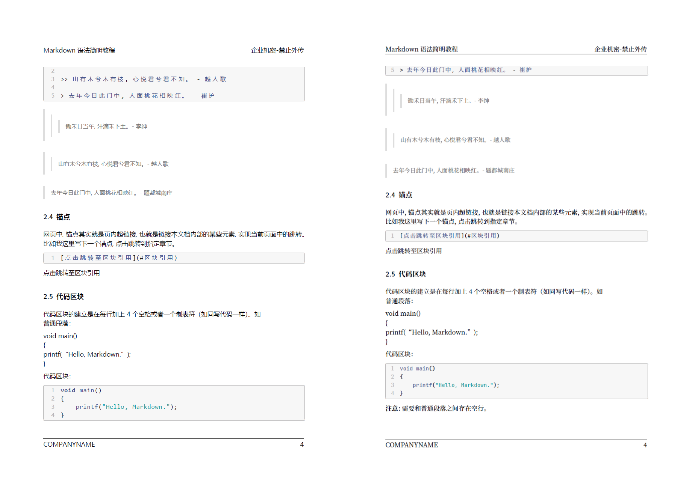

# MPPL

Markdown to PDF with Pandoc via \LaTeX{}.

# 基础环境配置

Markdown生成PDF主要需要使用Pandoc和Latex(texlive)两个工具，具体安装方式如下：

## Pandoc的安装

Pandoc是由John MacFarlane开发的标记语言转换工具，可实现不同标记语言间的格式转换。

-  Windows下的安装：
    - 下载[安装包](https://github.com/jgm/pandoc/releases)直接安装即可
    - 如果安装了Chocolate：`choco install pandoc`
    - 如果安装了winget：`winget install pandoc`

-  Linux/FreeBSD下的安装：
    - Pandoc已经包含在大部分Linux发行版的官方仓库中，直接使用诸如`apt/dnf/yum/pacman`之类的安装工具直接安装即可
  
-  MacOS下的安装：
    - `brew install pandoc`

> 详细的安装说明参见：[官方安装文档](https://pandoc.org/installing.html)

## LaTex 的安装

LaTex工具，在windows下建议安装miktex，Linux和MacOS下建议安装texlive

- Windows下的安装：
    - [参考该文章](https://zhuanlan.zhihu.com/p/41855480)下载完整texlive，注意安装后需要再安装cjk，cjk-fonts等相关package
- Linux/FreeBSD下的安装：
    - 使用 `apt/dnf/yum/pacman/pkg` 等安装工具安装texlive、texlive-latex等相关软件包
- MacOS下的安装：
    - 使用HomeBrew安装texlive即可

# 模板配置

## 配置Pandoc模板

为保证生成的pdf格式（自动插入封面、目录页、页眉页脚等信息），在本地环境中安装模板，具体步骤是：

- 下载本仓库
- 将`template/mppl.latex`拷贝到`*/pandoc/templates`目录下
    - Window下：`C:/Users/USERNAME/AppData/Roaming/pandoc/templates`，如果`Roaming`没有`pandoc`目录，请手动创建
  - Linux/FreeBSD/MacOS：`~/.pandoc/templates/`

## 配置LaTex模板

模板定制主要修改模板最前面的**模板基础配置**相关内容，主要可修改的包括：

- 公司和组织，目前默认是"MPPL"
- 正文缩进，目前默认是`0em`
-  主要中文字体和英文字体：目前都是微软雅黑
-  页眉、页脚展示内容，目前是：
   -  左页眉：标题
   -  右页眉："企业机密-禁止外传"
   -  左页脚：company
   -  右页脚：页码

## 字体设置

目前页面默认的字体是微软雅黑，对于非Windows系统，可能不存在该字体，则有以下两种解决方案：

1. 微软雅黑属于商业字体，无法分享，可以自行下载安装，字体名为`Microsoft YaHei`
1. 修改为已安装的其他字体
    - 将文档最前面的字体配置改为
        ```
        CJKmainfont: 中文字体名称
        mainfont: 英文字体名称
        monofont: 代码字体字体名称
        ```
### 字体推荐

- 中文字体：思源宋体
- 英文字体：微软雅黑
- 代码字体：JetBrainsMono

> 因为大部分用户还是装有微软雅黑，为了方便开箱即用所以没有将默认字体设为这两款字体。

1. 下载安装这两款字体[思源宋体](https://source.typekit.com/source-han-serif/cn/)，[JetBrains Mono](https://www.jetbrains.com/lp/mono/)。
1. 将文档最前面的字体配置改为
    ```
    CJKmainfont: SourceHanSerifSC-Medium
    monofont: JetBrainsMono-Medium
    ```

对比



# 生成PDF

## PDF文件指定metadata信息


在每个markdown最前面增加以下主要metadata信息，metadata内容开始行内容为三个“-”，结束行为三个“.”，示例如下：

```yml
title: "MPPL"
version: "0.1"
subtitle: "Markdown to PDF with Pandoc via LaTeX"
date: "2022-08"
author: "Dominic"
company: COMPANYNAME
file-code: COMPANY-DEPARTMENT-00000000
logo: true
logo-url: ./img/logo.png
history:
  - version: V0.1
    author: Dominic
    date: 2022-08-19
    desc: 创建文档
```

其他可选配置项目如下：

- header-left: 左页眉
- header-right: 右页眉
- footer-left: 左页脚
- footer-right: 右页脚
-  CJKmainfont: 主要中文字体
-  mainfont: 主要英文字体
-  monofont: 主要代码字体
-  lot: 是否创建表格目录
-  lof: 是否创建图片目录

> 可选配置项中，建议除了subtitle外，全部在模板中定制，不在markdown文件中定制

## 生成文件

```bash
pandoc --listings --pdf-engine=xelatex --template=mppl.latex README.md -o README.pdf
```

# 参考

模板主要修改自[eppdev/eppdev-pandoc-template](https://github.com/eppdev/eppdev-pandoc-template)
