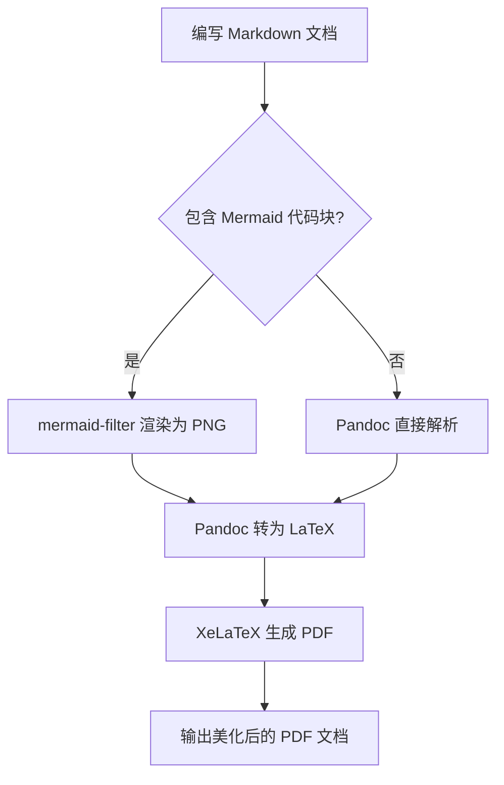
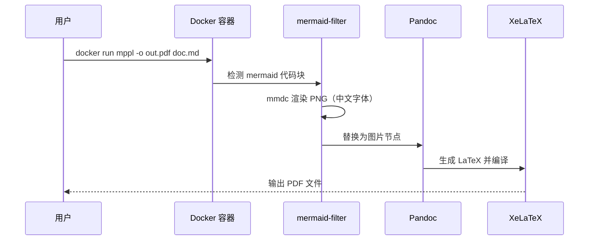
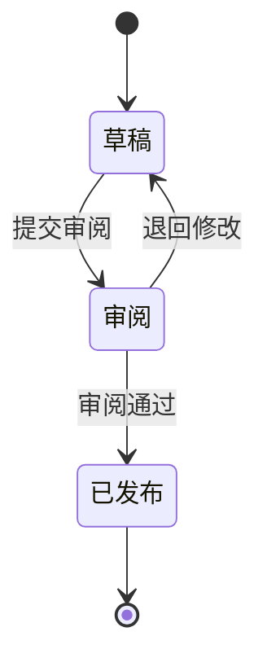
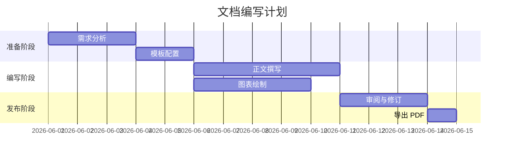
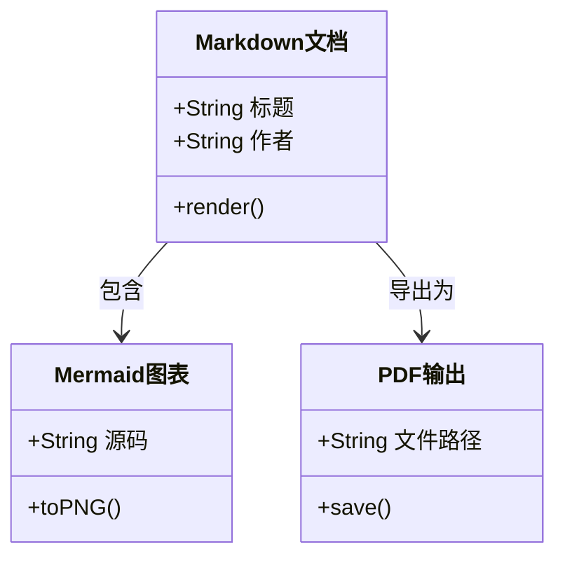

# Mermaid 图表导出

本文档演示 MPPL 如何将 Markdown 中的 Mermaid 代码块渲染为 PDF 内的图片。图表中的中文标签使用 **Source Han Serif SC**（与 MPPL 模板默认中文字体一致）。

渲染后的 PNG 图片会缓存到工作目录下的 `.mppl-mermaid-cache/`，重复转换相同内容时可复用，加快构建速度。

## 流程图

下面的流程图展示了文档从 Markdown 到 PDF 的处理流程：



## 时序图

以下时序图演示用户发起 PDF 转换时的交互过程：



## 状态图



## 甘特图



## 类图



## 使用说明

在 Markdown 中使用 Mermaid 时，用三个反引号包裹，并标注 `mermaid` 语言标识即可：

````markdown

````

如需调整单张图的宽度或分辨率，可在代码块属性中指定（Pandoc 扩展语法）：

````markdown
```{.mermaid width=1600 scale=3}
graph LR
    节点A --> 节点B
```
````

全局默认值：`MERMAID_FILTER_WIDTH=1400`、`MERMAID_FILTER_SCALE=2`。若仍觉得不够清晰，可尝试 `MERMAID_FILTER_SCALE=3`，修改后请删除 `.mppl-mermaid-cache/` 以重新渲染。

缓存目录默认为 `.mppl-mermaid-cache/`，可通过环境变量 `MERMAID_FILTER_LOC` 修改。
